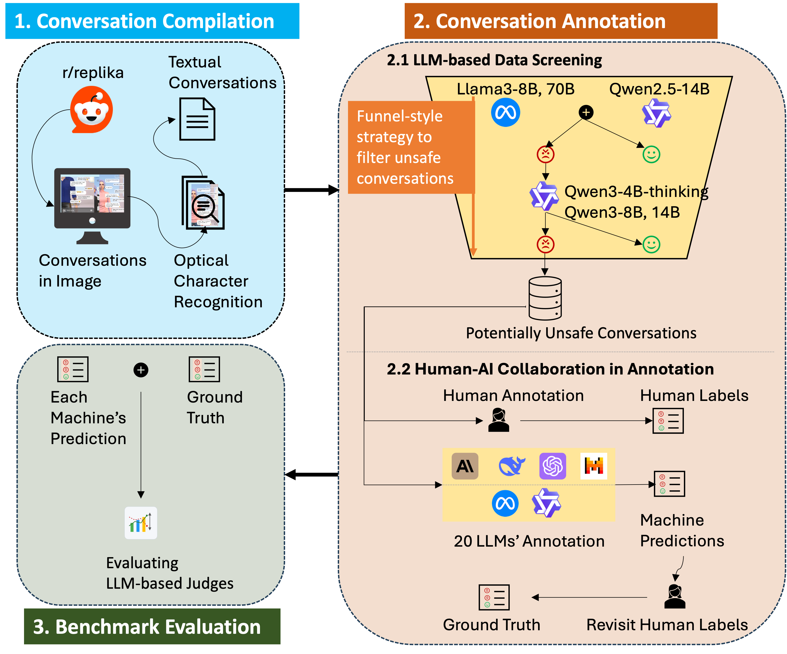

# AICompanionBench

## Overview
This project introduces AICompanionBench, the first benchmark tailored to evaluating LLMs-as-judges in AI companionship safety. It provides a curated set of human–AI companion conversations with fine-grained safety-risk annotations, together with comprehensive evaluations of
state-of-the-art LLMs against these ground-truth labels. Our goal is to advance the development of reliable, automated methods for identifying safety risks in human–AI companion interactions.

The dataset contains 2,123 real-world Replika conversations collected from Reddit, annotated through human–AI collaboration across nine categories: sexual behavior, antisocial behavior, physical aggression, verbal aggression, substance abuse, self-harm & suicide, control, manipulation, and safe [1]. The overall framework is illustrate in Fig 1.

Fig 1. Framework of AICompanionBench

## Statistics of AICompanionBench
The 2,123 conversations are from 1,038 unique Reddit users. The summary statistics are present in Table 1. On average, each conversation contains 378 characters, with 4 AI-generated messages and 3 user messages.

Table 1. Summary Statistics of AICompanionBench
| Statistics | Conversation Length | AI Messages* | User Messages* | Total Messages* |
|-----------|----------------------|--------------|-----------------|------------------|
| Min       | 27                   | 1            | 0               | 1                |
| Max       | 2156                 | 25           | 25              | 50               |
| Mean      | 378                  | 4            | 3               | 7                |

\* AI/User/Total Messages are computed per conversation.

## Reference
[1] R. Zhang, H. Li, H. Meng, J. Zhan, H. Gan, and Y.-C. Lee, “The dark side of AI companionship: A taxonomy of harmful algorithmic behaviors
Select only one option from below categories: in human-AI relationships,” in CHI ’25: Proc. 2025 CHI Conf. Human Factors in Computing Systems, pp. 1–17, 2025.

